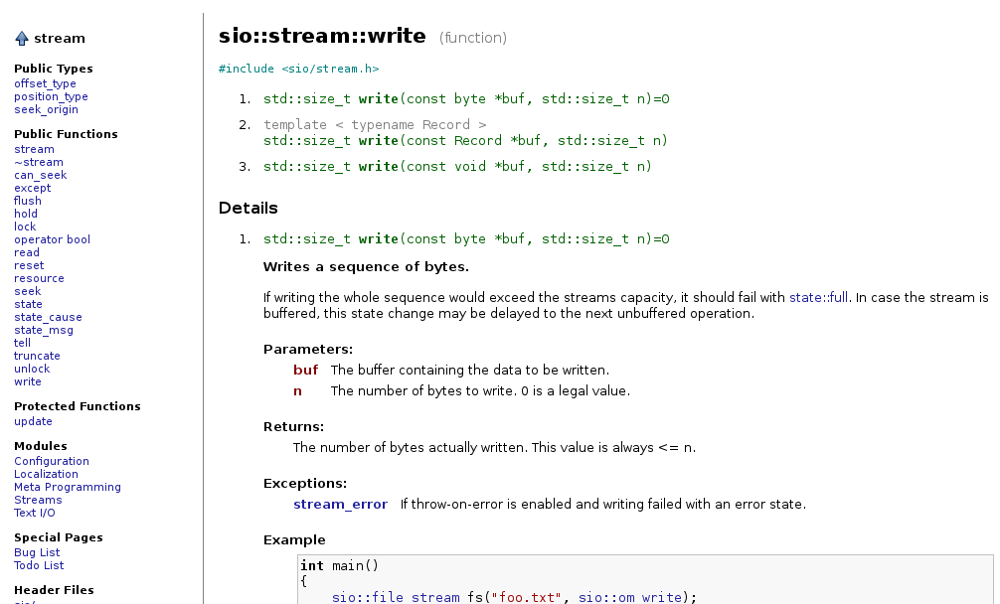

DoxyC++
=======

DoxyC++ is a Python script for generating HTML documentation by post-processing
data generated by [Doxygen](www.doxygen.org/).

Doxygen's HTML documentation is very OO-specific, building the layout around
classes and implementation hierarchies. Modern C++ does not fit this concept
very well and code built around static classes, templates and their 
specializations makes for very counterintuitive documentation.

Hence, DoxyC++ is namespace-, template- and overloading-oriented and aims for 
a layout similar to (The C++ Reference)[http://cplusplus.com]. Functions are
grouped by overloads, template specializations are part of the template's pages
and the overall navigation is simplified.

DoxyC++ is licensed under the GNU GPL Version 3.
